<h1 align="center">
    
</h1>
 

 

## Обо мне

Привет! Я Шаня, и я специализируюсь на создании не просто Discord-ботов, а полноценных, высокопроизводительных решений, способных выдерживать **значительные нагрузки и обеспечивать молниеносную скорость работы**. Моя цель — создавать ботов, которые не только функциональны, но и обладают **превосходным, продуманным дизайном**, выделяющимся среди конкурентов.

☁️ **В настоящее время я активно работаю над:** Discord ботами, ориентированными на production-уровень.

☁️ **Изучаю:** Python, TypeScript Rust для расширения своих возможностей и создания еще более мощных систем.

☁️ **Интересный факт:** Кошки спят больше половины своей жизни – так же, как и мои боты, они максимально эффективны в своей работе!

 

<h2 align="center"> Статистика </h2>

 

<picture>
  <source media="(prefers-color-scheme: dark)" srcset="./assets/overview.dark.svg" />
  
</picture>

  

<picture>
  <source media="(prefers-color-scheme: dark)" srcset="./assets/repositories.dark.svg" />
  
</picture>

  

<picture>
  <source media="(prefers-color-scheme: dark)" srcset="./assets/languages.dark.svg" />
  
</picture>

  

 

<h2 align="center"> Мой Discord </h2>

  

 
 
